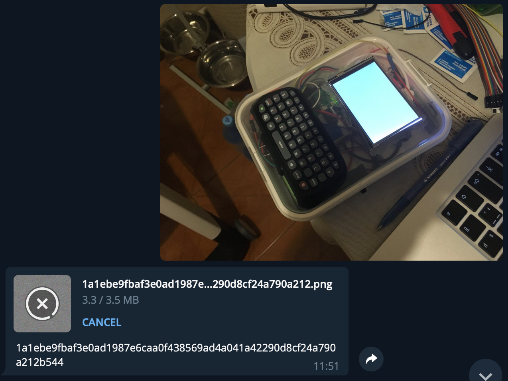
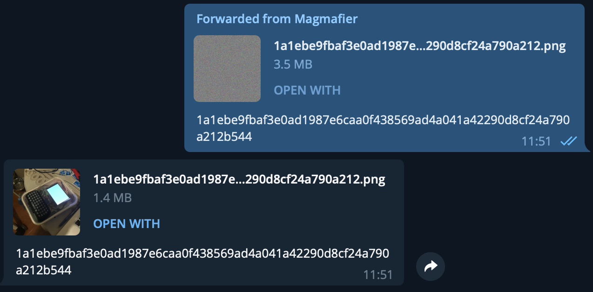

# Magmafier
It's a Telegram bot which can cipher images using GOST 34.12-2018 cipher "Magma" implementing CTR mode

[@MagmafierBot](https://t.me/MagmafierBot)

## Usage

#### Cipher
Simply send a photo to bot and it will send you a crypted version as a **Document without compression** and a key for decipher.

 

You can also set a predicted key as a **Photo** or **Document** caption.
If you cannot use caption _(iOS Telegram client hasn't got this feature)_ you can simply send key as a plain text message. 
This will set the key for some time.

##### Decipher

To decipher send only **images as documents** because jpeg loses some information to be properly deciphered.

  

This was my theme for thesis. Have a fun!

_This project was created for educational purposes._
